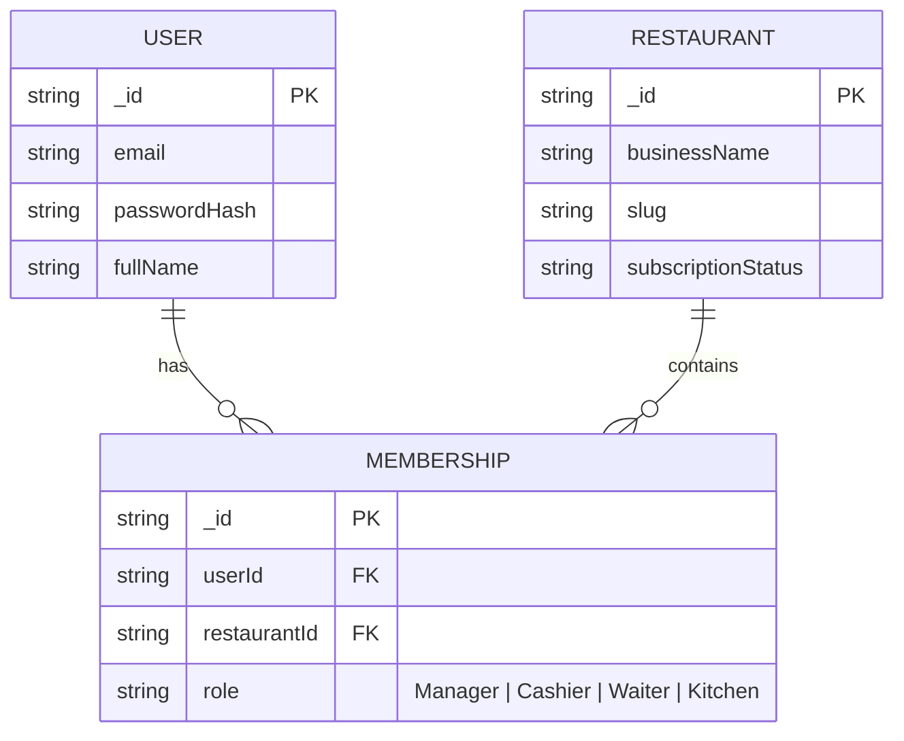
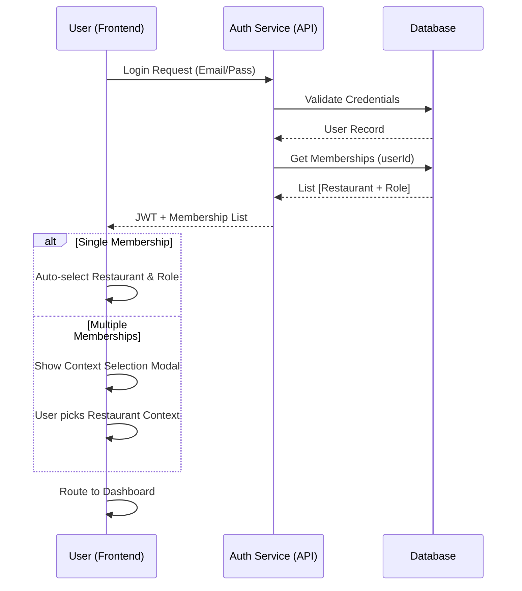
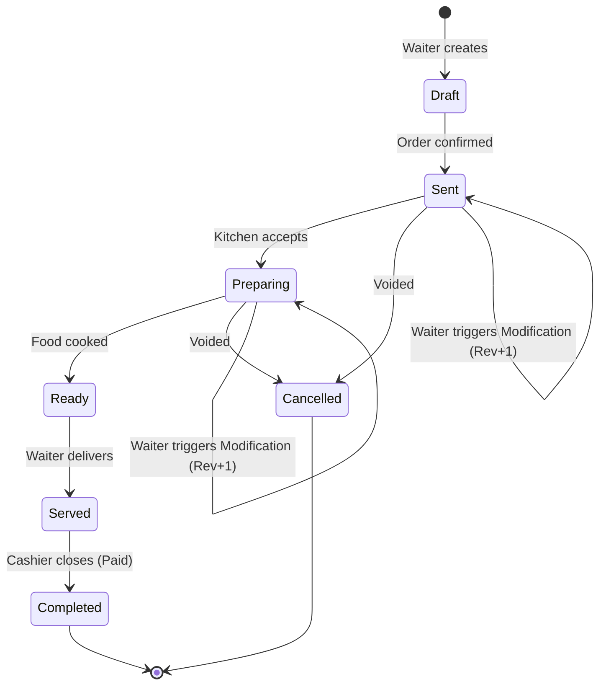
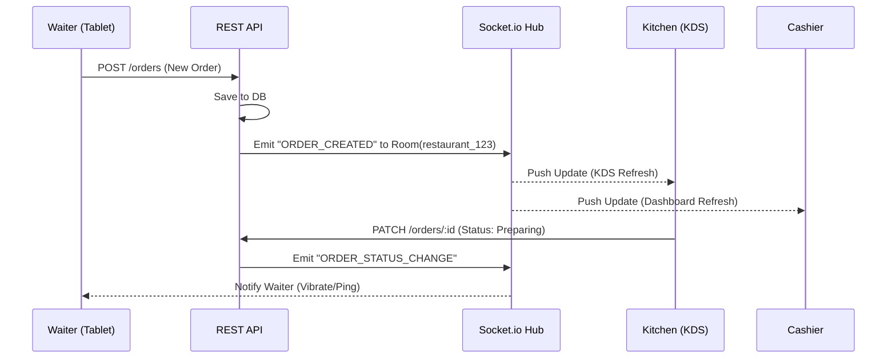

# Yapakit - Core Architecture & SaaS Blueprint

**Version:** 1.0.0 (Foundational)  
**Focus:** B2B Core Operations (Waiter -> Kitchen -> Cashier)  
**Infrastructure Stack:**

- **Frontend:** React / TypeScript SPA (Vercel/Netlify)
- **Backend:** Node.js / Express / Socket.io (Heroku/Cloudways)
- **Database:** MongoDB (Multi-Tenant Schema)
- **Image CDN:** Cloudinary (Logo, Hero, Menu Item photos)

---

## 1. Multi-Tenant Architecture & Security (RBAC)

Yapakit utilizes a **Decoupled User-Restaurant structure**. This allows a single identity (User) to hold memberships in multiple restaurants with different roles, enabling a scalable SaaS model.

### Database Schema (User & Restaurant Relationship)

The high-level relationship between users, restaurants, and their memberships is managed via a pivot collection to maintain strict isolation and performance.

### V1 Permission Matrix

Roles are hardcoded for V1 to ensure a stable feature freeze.

| Role           | Scope       | Permissions                                               |
| :------------- | :---------- | :-------------------------------------------------------- |
| **Superadmin** | System-wide | View all tenants, system health, manage support accounts. |
| **Support**    | System-wide | View-only access to tenant data for troubleshooting.      |
| **Manager**    | Tenant      | Full restaurant control (Menu, Staff, Reports).           |
| **Cashier**    | Tenant      | Payment processing, split checks (item/amount), shifts.   |
| **Waiter**     | Tenant      | Order creation, modification (Rev: N), cancellations.     |
| **Kitchen**    | Tenant      | View outgoing orders, update preparation status.          |

### Authentication & Context Selection Flow

Users log in globally but must operate within a specific restaurant context.

---

## 2. Order Management System (OMS) & Real-Time Flow

Order management is built for speed and high-precision status tracking.

### Order Lifecycle (Unidirectional Path)

### WebSocket Architecture (Socket.io)

To ensure low latency and prevent memory leaks, real-time updates are confined to **Restaurant Rooms**.

- **Namespace:** `/orders`
- **Room Strategy:** `restaurantId` as the unique room identifier.
- **Payload Policy:** Small JSON chunks containing standard event types (e.g., `ORDER_STATUS_UPDATED`).

### Mobile-First Offline Resilience

Given the instability of restaurant WiFi, Yapakit implements **Optimistic UI & Background Syncing**:

- **Optimistic UI:** Orders are immediately added to the UI with a "Pending Sync" status.
- **IndexedDB Store:** Local persistence using Browser Storage (IndexedDB/Redux-Persist).
- **Retry Queue:** Failed API requests are added to a background queue that retries automatically once the connection is restored.

---

## 3. Infrastructure & Deployment Strategy

Yapakit follows a "Decoupled Best-of-Breed" deployment strategy.

### Layer 1: Frontend (Static/Global)

- **Platform:** Vercel or Netlify.
- **Function:** Serves the React bundle via Global Edge CDN.
- **Benefit:** Instant loading times anywhere in the world and high availability.

### Layer 2: Backend (API & Real-time)

- **Platform:** Cloudways (DigitalOcean/Vultr) or Heroku.
- **Function:** Dedicated Node.js runtime for REST API processing and WebSocket state management.
- **Security:** TLS/SSL encryption for all data in transit.

### Layer 3: Database (Persistent)

- **Platform:** MongoDB Atlas.
- **Schema:** Multi-tenant document structure with indexes on `restaurantId` for query isolation and speed.

---

## 4. Public-Facing Applications (B2C)

Yapakit includes public, unauthenticated routes (`/p/:slug`) explicitly designed to interact with the end customer natively inside a flat-color design system.

- **Public Digital Menu:** Exposes real-time availability of items scoped explicitly to the querying client avoiding private backend details.
- **Table Reservation Wizard:** A step-by-step unauthenticated UI for placing booking requests.
  - **Availability Algorithm:** The server cross-references `operatingHours` against the sum of pending and confirmed bookings vs raw table counts natively.
  - **Blind Customer Merge:** Re-uses a generalized Upsert pattern `Customer.findOneAndUpdate({ email/... }, { upsert: true })` wrapping the booking user directly into the Yapakit POS CRM automatically.

---

**End of Document**  
_Company Confidential - Kodffe / Yapakit Technology Group_
